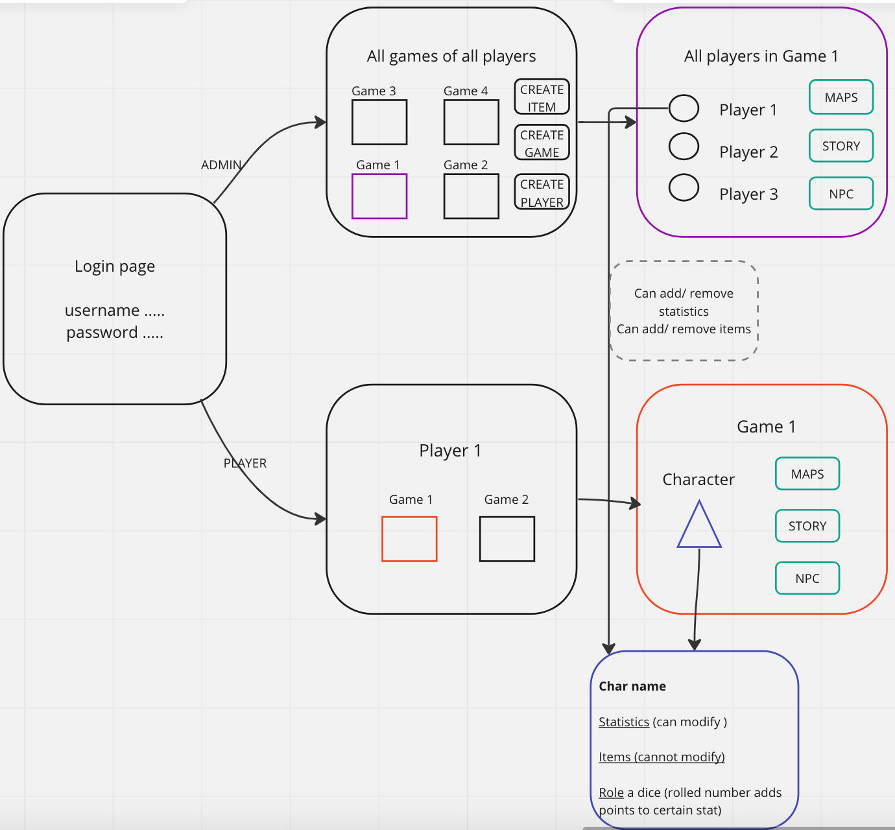

# DndApplication
Terminai:
DnD - Dungeons and dragons stalo vaidmenų žaidimas
Scenarijus - kelis mėnesius trunkanti žaidimo sesijų seka
Sesija - Kelias valandas vykstantis veikėjų ir vedėjo žaidimas

Ši aplikacija skirta “Dungeons and Dragons” (toliau: DnD) stalo žaidimo scenarijaus progreso sekimui. Kadangi šie stalo žaidimai vyksta kelerius mėnesius su savaitės tarpais tarp sesijų, yra didelis poreikis patogiam žaidimo vystimosi, žaidėjų progreso, statistikų ir istorijos sekimui.

Žaidime dalyvauja vedėjas (toliau: DM - dungeon master) ir keletas veikėjų (angl. Character). Vienu metu tiek vedėjas, tiek veikėjai gali dalyvauti keliuose žaidimuose, vykstančiuose paraleliai.

Aplikacija turi suteikti galimybę identifikuoti vartotoją ir autorizuoti jį kaip vedėją (admin) arba žaidėją (user). (Login page)

Kiekvienas žaidėjas turi matyti visus žaidimų scenarijus, kuriuose jis dalyvauja.
Kiekvienas vedėjas turi maty visus savo vedamus scenarijus.

Kiekvienas Scenarijus (žaidimas) savyje turi vedėją, veikėjus, žaidimo pasaulio vietoves, žaidimo pasaulio NPC (non playable characters - veikėjus, kurie yra valdomi vedėjo), objektus arba daiktus.

Žaidimo pasaulis - paveiksliukai, žemėlapiai, vietovės, aprašymas.
Vietovės - paveiksliukai, žemėlapiai, aprašymai.
NPC - paveiksliukai, statistikos, aprašymas.
Objektai, daiktai - paveikslėliai, aprašymas.
Veikėjas - paveikslėliai, aprašymas, statistikos, objektai/daiktai.

Žaidėjas valdo vieną veikėją viename scenarijuje.
Veikėjas turi galėti:
Modifikuoti savo statistikas (Jėga, intelektas, vikrumas, charizma ir t.t.)
Matyti jam priskirtus daiktus/objektus, kuriuos gavo žaidimo metu.
Matyti žaidimui priskirtas vietas ir NPC.

DM’as (administratorius) turi galėti:
Kurti Scenarijus.
Kurti daiktus/objektus, jų aprašymus ir įkelti paveikslėlius.
Kurti vietoves, jų aprašymus ir įkelti paveikslėlius/žemėlapius
Priskirti veikėjams daiktus/objektus
Priskirti žaidimui (scenarijui) vietoves ir NPC.

Trumpai: vedėjas turi galėti kurti pasaulį ir jo istoriją, atskleisdamas žaidėjams istoriją po truputį, leisti žaidėjams įtakoti pasaulio vystimąsį. Žaidėjai naudodami daiktus, žinias apie pasaulį ir savo gebėjimus (statistikas) įtakoja pasaulį bandydami pasiekti jiems iškeltą tikslą.

Aplikacija turi leisti sukurti vartotoją ir priskirti jam žaidėjo arba DM rolę.

Aplikacija turi leisti sugeneruoti atsitiktinį skaičių (kauliuko metimo imitaciją) kiekvienai statistikai. Statistikos gali turėti kintamą atsitiktinio skaičiaus generavimo rėžį (1-20,1-4,1-6,1-8,1-10,1-12,1-100)

Kauliuko metimas skaičiuojamas tokiu būdu: metimas plius statistikos modifikacija, kuri gali būti tiek teigiama, tiek neigiama. PVZ: metimas: 12, statistika: 3, sumoje: 15; metimas: 8, statistika: -3, sumoje: 5.

Vizualizacija:
Prisijungės vartotojas mato savo žaidimus
Pasirinkęs žaidimą mato savo veikėją ir pasaulį
Pasirinkęs veikėją mato veikėjo statistikas ir daiktus
Pasirinkęs pasaulį mato vietoves, NPC
Administratorius DM turi matyti visus žaidimo/scenarijaus elementus ir galėti juos modifikuoti

Preliminarūs aplikacijos puslapiai su pagrindiniu funkcionalumu:

